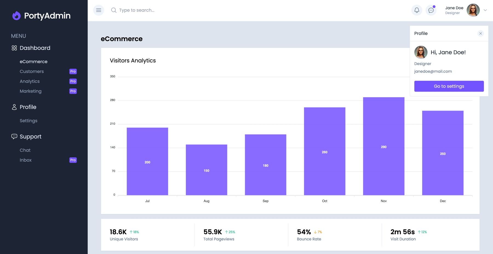
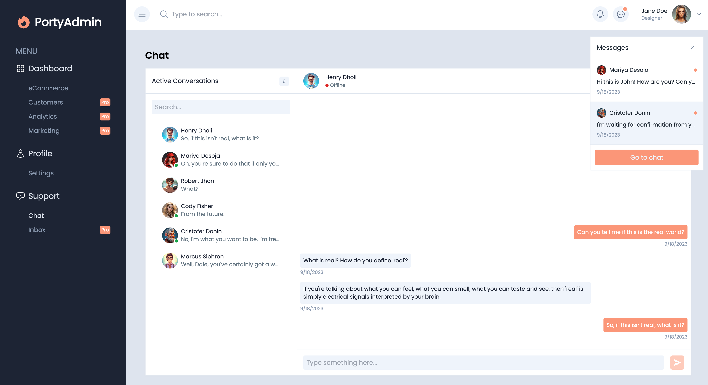
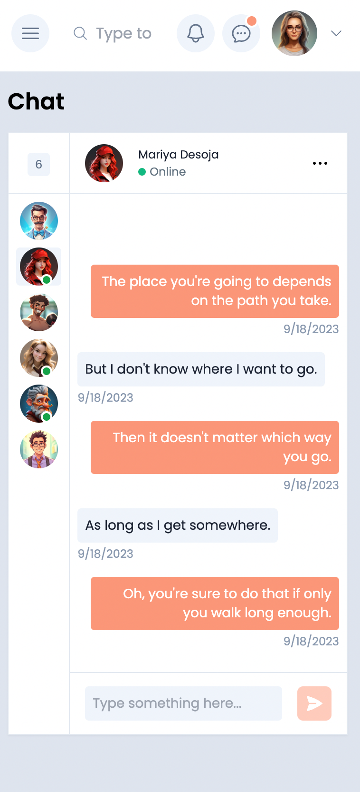
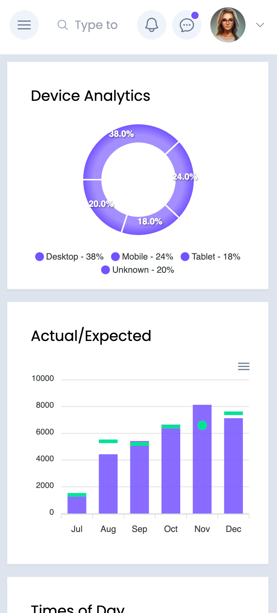
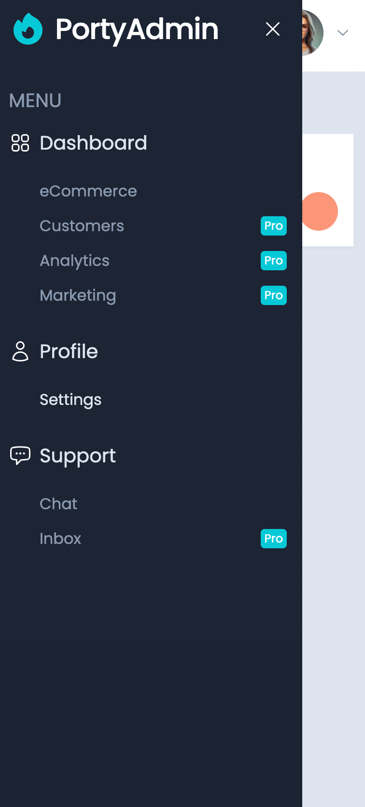

# Dashboard Interface

## Technologies

- React
- Tailwind CSS
- ApexCharts
- TypeScript

## Overview

This project is a versatile dashboard interface that uses React, Tailwind CSS, ApexCharts, and TypeScript to provide a
dynamic user experience.

## Images

**eCommerce**

**Chat**

**Mobile chat/eCommerce/menu**

## Features

1. **eCommerce Demo Page**
    - Visualizes eCommerce data with interactive ApexCharts.

2. **Settings Page**
    - Allows users to customize the color theme.

3. **Chat Page**
    - Chat with message search.

4. **Pop-ups**
    - Notifications, messages, and user profile pop-ups.

## Responsive Design

The dashboard is fully responsive, adapting seamlessly to desktops, mobile devices, and tablets.

## Getting Started

1. Clone the repository.
2. Install dependencies with `npm install` or `yarn install`.
3. Start the development server with `npm start` or `yarn start`.
4. Access the dashboard at `http://localhost:3000`.

## Contributions

Contributions are welcome. Fork the repository and submit pull requests to enhance the project.
